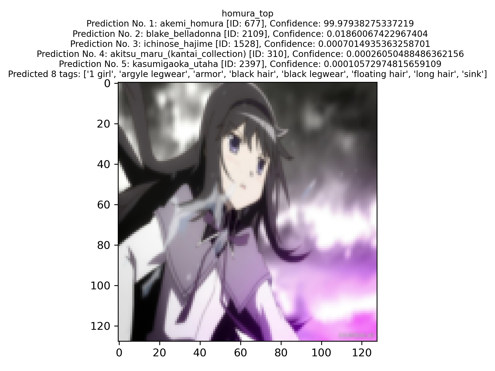
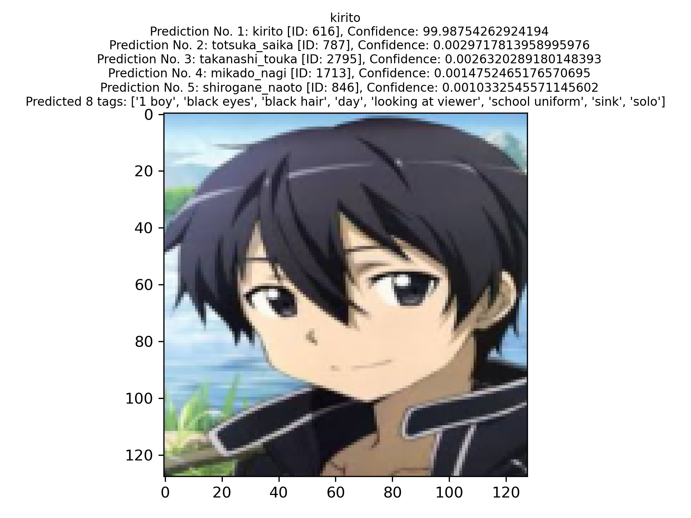
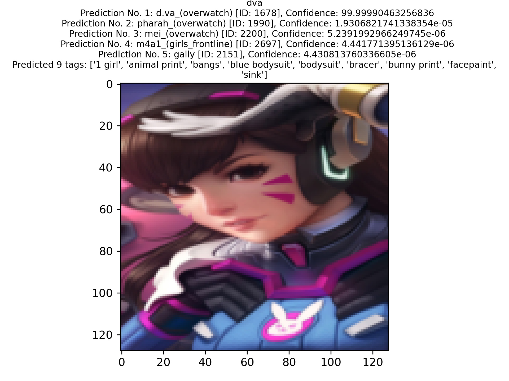
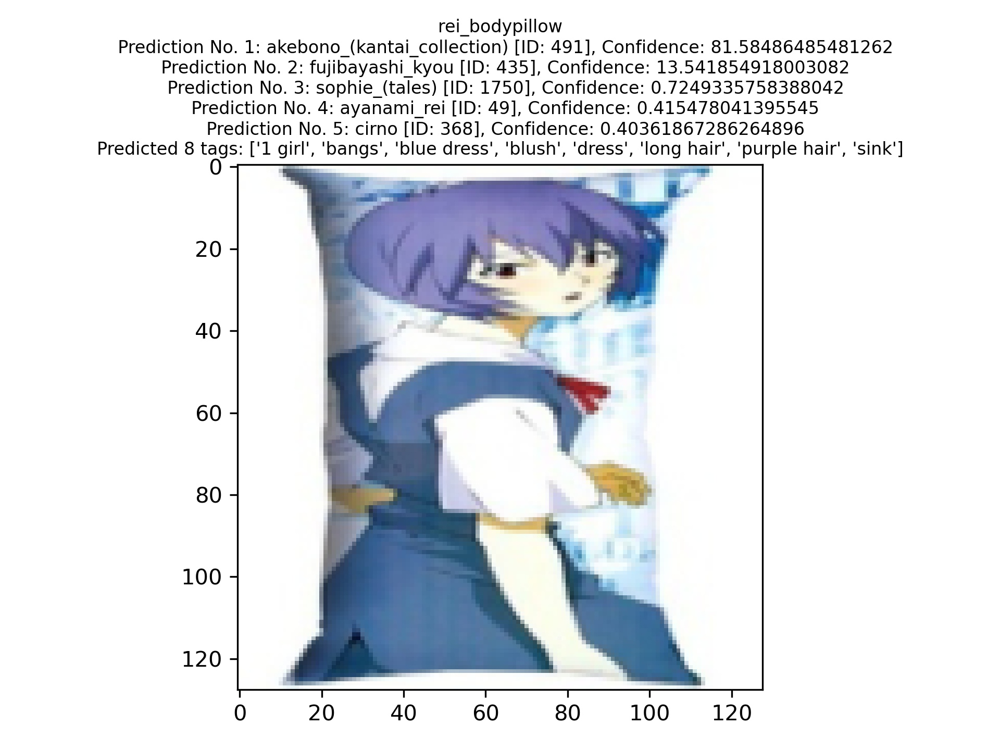
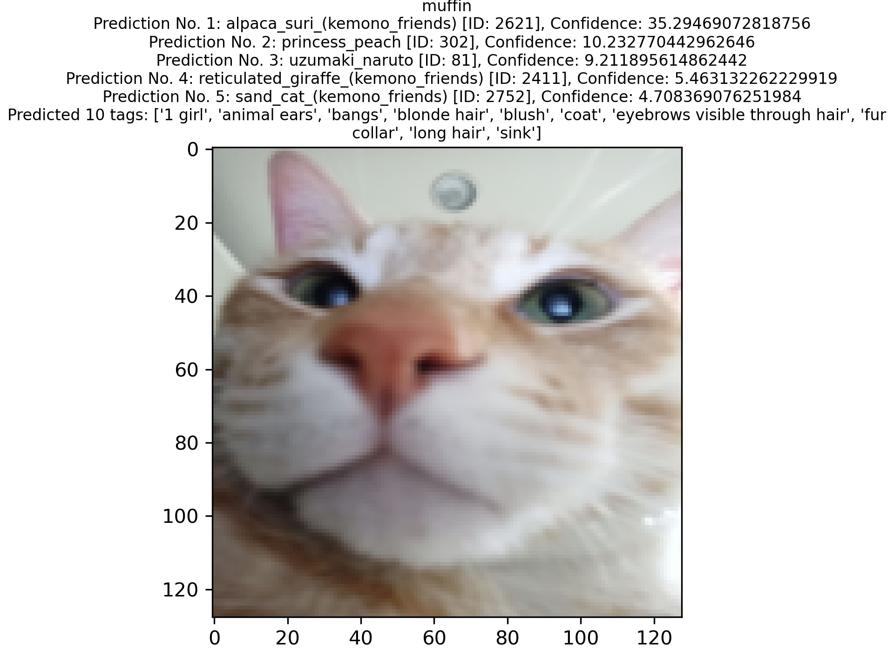
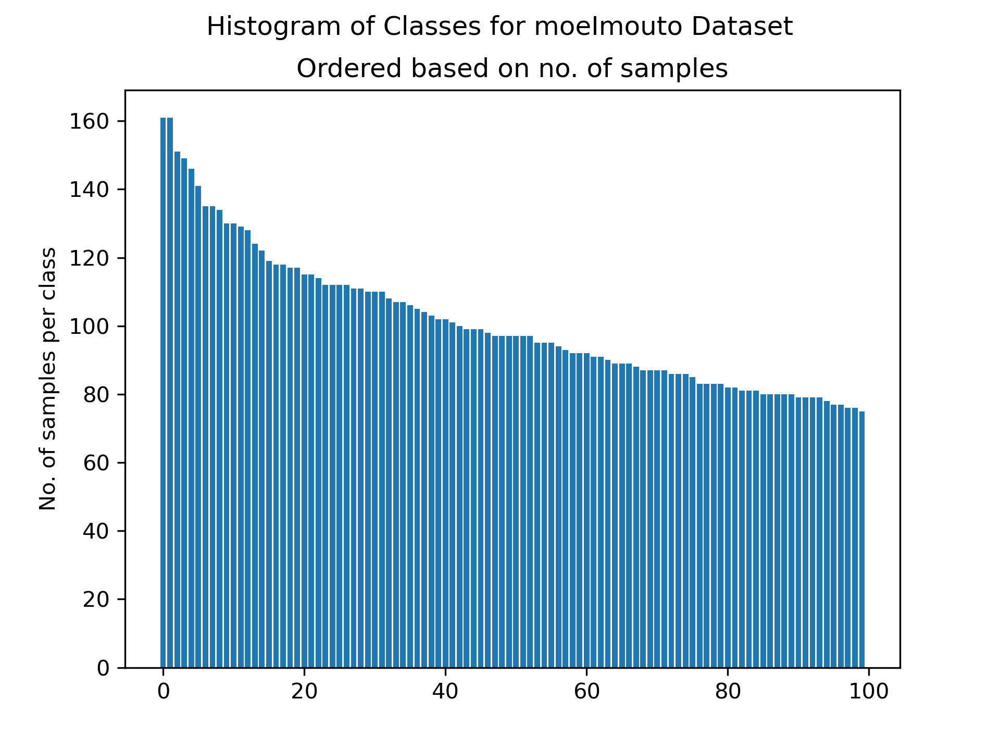
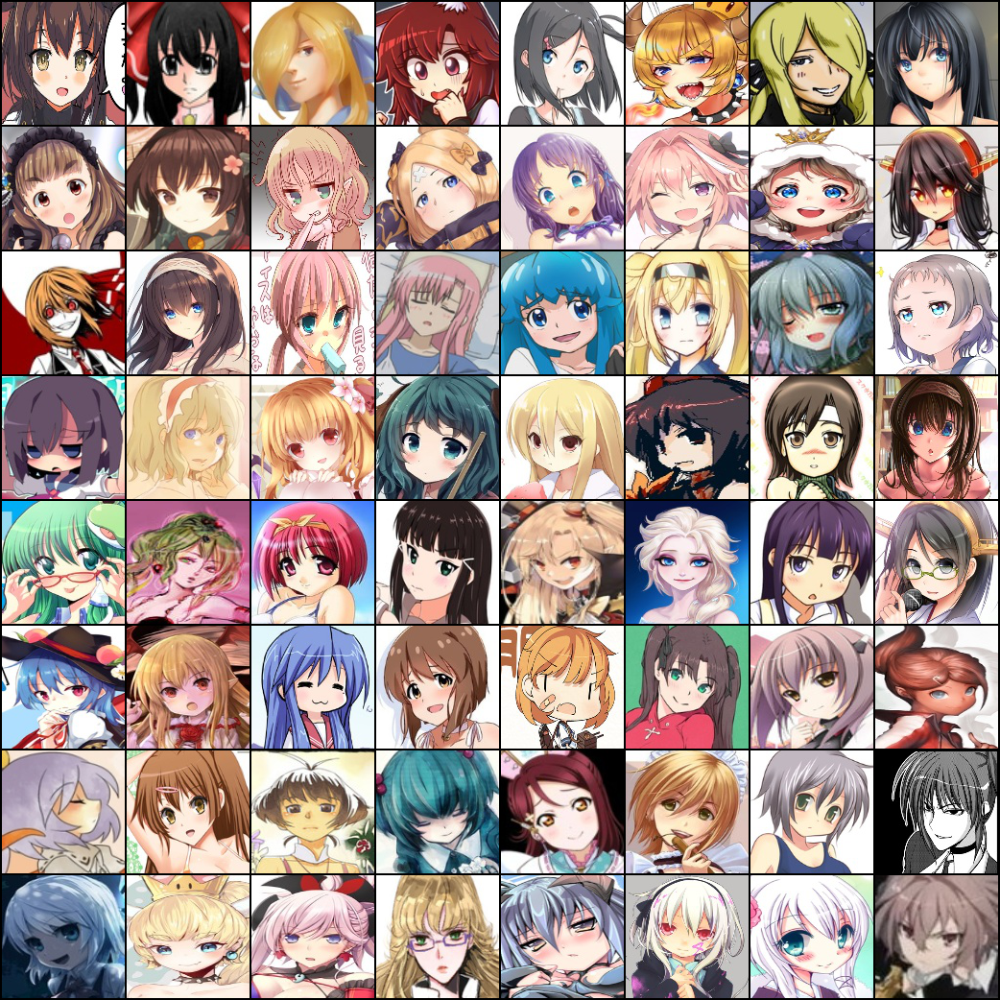
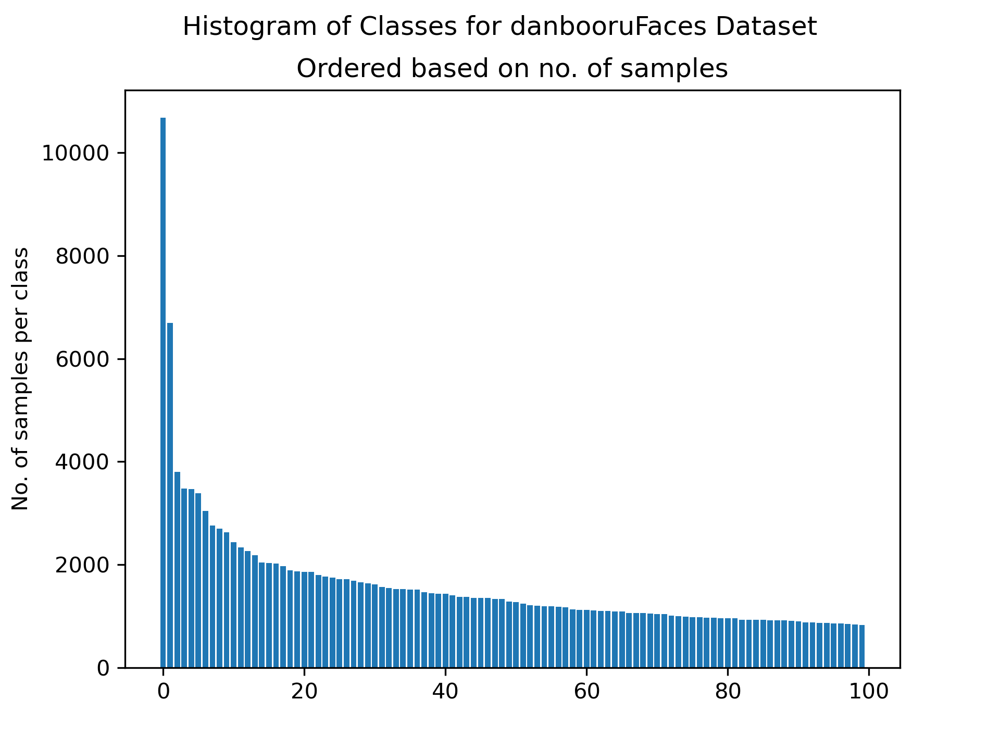

# Overview 
Anime character recognition and tagging using PyTorch.

Our best vision-only model, ViT L-16 with image size 128x128 and batch size 16 achieves to get 89.71% 
and 96.14% test set top-1 and top-5 classification accuracies, respectively, among 3263 characters!

We hope that this work inspires other researchers to follow and build upon this path. 

Checkpoints and data: [Google Drive](https://drive.google.com/drive/folders/1Tk2e5OoI4mtVBdmjMhfoh2VC-lzW164Q?usp=sharing).


# Features
* Variety of architectures to choose from: Shallow, Resnet18/50/152, EfficientNet-B0, Vi(L)T B-16/B-32/L-16/L-32
* Two fully-fledged datasets, moeImouto and DAF:re, with 173 and more than 3000 classes, respectively
* Pre-trained models for best performing models using image size of 128x128.
* Supporting scripts for making, visualization and stats for datasets.
* Scripts for training from scratch, evaluation (accuracy of a model with a certain set and pretrained weights), and inference (classifies all images in a given (`test_images` by default) folder.
 

# How to (summary)

## Data preparation
From `data` folder in Google Drive download `dafre_faces.tar.gz` for `DAF:re Faces` or `dafre_full.tar.gz` for `DAF:re Full`, and `labels.tar.gz` and uncompress their contents into desired data storage location. The `dataset_path` argument expects a path to the root that contains both `faces` or `fullMin256` directories, along with `labels` at the same level.

## Training
Train a ViT B-16 vision only model with intermediate features aggregation classification head on DanbooruFaces for recognition: 
`python train.py --dataset_name danbooruFaces --dataset_path YOUR_PATH --model_name B_16 --image_size 128 --batch_size 64 --learning_rate_scheduler warmupCosine --pretrained --interm_features`

Train a ViLT B-16 with tag/language tokens on DanbooruFull for recognition: 
`python train.py --dataset_name danbooruFull --dataset_path YOUR_PATH --model_name B_16 --image_size 128 --batch_size 64 --learning_rate_scheduler warmupCosine --pretrained --multimodal --max_text_seq_len 32 --tokenizer wp`

Train a ViLT B-16 with tag/language tokens on DanbooruFull for recognition and tagging: 
`python train.py --dataset_name danbooruFull --dataset_path YOUR_PATH --model_name B_16 --image_size 128 --batch_size 16 --learning_rate_scheduler warmupCosine --pretrained --multimodal --max_text_seq_len 16 --tokenizer tag --mask_schedule full --masking_behavior constant`

## Inference
Load pretrained model for recognition (defaults: B-16, IS=128):
`python inference.py --dataset_path YOUR_PATH --checkpoint_path PATH_TO_CHECKPOINT`

Load pretrained model for recognition and tagging (defaults: B-16, max_text_seq_len=16, tokenizer='tag'):
`python inference.py --dataset_path YOUR_PATH --checkpoint_path PATH_TO_CHECKPOINT --mode recognition_tagging`

Demo for recognition and tagging with [gradio](https://gradio.app/):
`python demo.py --dataset_path YOUR_PATH -checkpoint_path PATH_TO_CHECKPOINT`

## Evaluation
Evaluate on test set of chosen dataset using pretrained model for recognition (defaults: B-16, IS=128):
`python evaluate.py --dataset_path YOUR_PATH --checkpoint_path PATH_TO_CHECKPOINT`


# Sample results


It not only works for anime images, but also works that take inspiration from anime, such as many videogames. 

And also for images that are not a face-crop:


We also tried it for people (and a cat), so hopefully I'll be able to post some results of that later. What came to me as interesting is that for the cat, it predicted `Naruto`, I guess based on the whiskers. Also, for a friend with curly hair, among the predictions included `Yamagishi Yukako`, a character with similar characteristics. 



While the results were certainly far from perfect, this can serve as a basis for more studies on domain adaptation from natural images to sketches and drawn media.


# How to use (detailed)
The main scripts in this repo are the `train.py`, `evaluate.py` and `inference.py`.
 
## train.py
This script takes as input a set of hyperparameters (dataset to use, model, batch and image size, 
among others) and trains the model, either from scratch, or from a checkpoint. 
If training from a checkpoint, it can also use it to do knowledge transfer between datasets, 
by for example using a checkpoint trained on *DAF:re* to classify images according to the characters in *moeImouto*. 
It can also train a model based on both images and tags data.
```
usage: train.py [-h]
                [--dataset_name {moeImouto,danbooruFaces,cartoonFace,danbooruFull}]
                [--dataset_path DATASET_PATH]
                [--model_name {shallow,resnet18,resnet50,resnet152,efficientnetb0,B_16,B_32,L_16,L_32}]
                [--results_dir RESULTS_DIR] [--image_size IMAGE_SIZE]
                [--batch_size BATCH_SIZE] [--no_epochs NO_EPOCHS]
                [--learning_rate LEARNING_RATE]
                [--lr_scheduler {warmupCosine,epochDecayConstant}]
                [--epoch_decay EPOCH_DECAY] [--warmup_steps WARMUP_STEPS]
                [--pretrained] [--checkpoint_path CHECKPOINT_PATH]
                [--transfer_learning]
                [--log_freq LOG_FREQ]
                [--save_checkpoint_freq SAVE_CHECKPOINT_FREQ]
                [--no_cpu_workers NO_CPU_WORKERS] [--seed SEED]
                [--interm_features_fc] [--debugging]
                [--max_text_seq_len MAX_TEXT_SEQ_LEN]
                [--mask_schedule {None,bert,full,sigmoid}]
                [--mask_wu_percent MASK_WU_PERCENT]
                [--mask_cd_percent MASK_CD_PERCENT] [--ret_attn_scores]
                [--tokenizer {wp,tag}] [--masking_behavior {constant,random}]
                [--shuffle_tokens]

optional arguments:
  -h, --help            show this help message and exit
  --dataset_name {moeImouto,danbooruFaces,cartoonFace,danbooruFull}
                        Which dataset to use.
  --dataset_path DATASET_PATH
                        Path for the dataset.
  --model_name {shallow,resnet18,resnet50,resnet152,efficientnetb0,B_16,B_32,L_16,L_32}
                        Which model architecture to use
  --results_dir RESULTS_DIR
                        The directory where results will be stored
  --image_size IMAGE_SIZE
                        Image (square) resolution size
  --batch_size BATCH_SIZE
                        Batch size for train/val/test.
  --no_epochs NO_EPOCHS
                        Total number of epochs for training.
  --learning_rate LEARNING_RATE
                        Initial learning rate.
  --lr_scheduler {warmupCosine,epochDecayConstant}
                        LR scheduler.
  --epoch_decay EPOCH_DECAY
                        After how many epochs to decay the learning rate once.
  --warmup_steps WARMUP_STEPS
                        Warmup steps for LR scheduler.
  --pretrained          For models with pretrained weights
                        availableDefault=False
  --checkpoint_path CHECKPOINT_PATH
  --transfer_learning   Load partial state dict for transfer learningResets
                        the [embeddings, logits and] fc layer for ViTResets
                        the fc layer for ResnetsDefault=False
  --log_freq LOG_FREQ   Frequency in steps to print results (and save images
                        if needed).
  --save_checkpoint_freq SAVE_CHECKPOINT_FREQ
                        Frequency (in epochs) to save checkpoints
  --no_cpu_workers NO_CPU_WORKERS
                        CPU workers for data loading.
  --seed SEED           random seed for initialization
  --interm_features_fc  If use this flag creates FC using intermediate
                        features instead of only last layer.
  --debugging           If use this flag then shortens the training/val loops
                        to log_freq*3.
  --multimodal          Vision+tags if true
  --max_text_seq_len MAX_TEXT_SEQ_LEN
                        Length for text sequence (for padding and truncation).
                        Default uses same as image.
  --mask_schedule {None,bert,full,sigmoid}
                        Scheduler for masking language tokens.
  --mask_wu_percent MASK_WU_PERCENT
                        Percentage of training steps for masks warmup
  --mask_cd_percent MASK_CD_PERCENT
                        Percentage of training steps for masks cooldown
  --ret_attn_scores     Returns attention scores for visualization
  --tokenizer {wp,tag}  Tokenize using word-piece (BERT pretrained from HF) or
                        custom tag-level
  --masking_behavior {constant,random}
                        When masked convert token to 1 or to a random int in
                        vocab size
  --shuffle_tokens      When turned on it shuffles tokens before sending to
                        bert or custom tokenizer
```

## inference.py
Same arguments as previous one but also additionally takes mode (recognition_vision for recognition only, and recognition_tagging for doing both),
test_path for the images to test (tests all files in directory), results_infer (where to save), and save_results (save images with visualization of
class probabilities if doing vision ony recognition).

```
usage: inference.py [--mode {recognition_vision,recognition_tagging,generate_tags}] [--test_path TEST_PATH]
                    [--results_infer RESULTS_INFER] [--save_results SAVE_RESULTS]

  --mode {recognition_vision,recognition_tagging,generate_tags}
                        Mode for inference (multimodal or vision).
  --test_path TEST_PATH
                        The directory where test image is stored.
  --results_infer RESULTS_INFER
                        The directory where inference results will be stored.
  --save_results SAVE_RESULTS
                        Save the images after transform and with label results.
```

## evaluate.py
Main functionality is the evaluate() function which loads a pretrained model from a checkpoint and evaluates it on the given dataset, 
returning top-1 and top-5 accuracies for the test split, along with accuracies and stats for each character class and stores it into log files with same name as checkpoint, 
and saved to `results_dir` which becomes `results_inference` by default but can be changed by using the argument.
Same arguments as `train.py` but includes eval_imagebyimage flag to inspect one by one wrong classification results 
(with possibility of saving them with save_results flag).
```
[--vis_arch] [--eval_imagebyimage] [--save_results]

  --vis_arch            Visualize architecture through model summary.
  --eval_imagebyimage   Evaluate all or image by image
  --save_results        Save the images after transform and with label results.
```


# Others

## Data exploration
Visualization for the data in terms of histograms, image grids, and statistics related to the classes distributions can be obtained by using `data_exploration.py`. Parent argument parser is the same as `train.py` but the important ones are the following:
```
[--split SPLIT]
                           [--data_vis_full] [--labels] [--display_images] [--stats_partial]

--split SPLIT         Split to visualize
  --data_vis_full       Save all images into a video.
  --labels              Include labels as title during the visualization video (requires a LOT more time).
  --display_images      If False skips to data_stats function else display images as single plot or video.
  --stats_partial       If true will display stats for a certain subset instead of the whole.
```
For example to generate a grid for danbooruFull's test split with labels printed as the title: 
`python data_exploration.py --dataset_path PATH --split test --display_image --dataset_name danbooruFull --labels`

For a visualization of all the splits (along with the labels): [YouTube playlist](https://youtube.com/playlist?list=PLenBV8wMp2FyJHvBZM4FBxua7JggUUqvQ). In total, there's 6 videos, 3 for *DAF:re* and 3 for *moeImouto*.

A brief preview can be seen here for DAF:re and moeImouto, respectively:


## Datasets

### moeImouto
For the moeImouto dataset here's a sample of how the images look along with their classes. For the training and testing split files: [moeImouto repo](https://github.com/arkel23/moeimouto_animefacecharacterdataset)

Histogram of classes with most samples.

The dataset itself can be downloaded from [Kaggle](https://www.kaggle.com/mylesoneill/tagged-anime-illustrations/home) then stored in a folder containing the rest of the files, following the structure `moeImoutoDataset/data/`, where `data/` contains the folders containing images divided by class and the base folder `moeImoutoDataset/` contains the files included in the [repo](https://github.com/arkel23/moeimouto_animefacecharacterdataset) I described previously (`train.csv`, `test.csv`, and `classid_classname.csv`).

### DAF:re
Similarly, for DAF:re. Also, here's the repo for some more details on the dataset along with the instructions for downloading data, labels and supporting scripts: [DAF:re repo](https://github.com/arkel23/Danbooru2018AnimeCharacterRecognitionDataset_Revamped)

Histogram of classes with most samples. It's clear that the distribution is very long-tailed.



## Models
Shallow is a shallow, 5 layer (2 convolutional + 2 fully-connected) network. ResNet-18/152 has been the basis for many CNN architectures and was SotA for image classification just a few years ago [(paper)](https://arxiv.org/abs/1512.03385). Vision Transformers [(ViT paper)](https://arxiv.org/abs/2010.11929) are the new SotA for image classification in many standard benchmarks such as ImageNet, among others. Their significance is that they forego convolutions completely, and rely only on self-attention. This allows ViT to attend to distant regions in the image, as it looks as the whole image as a sequence of patches, all at once. This is in comparison to CNNs which traditionally "look" at the image patch by patch, rendering them unable to grasp long-range dependencies.


# References
If you find this work useful, please consider citing:

* E. A. Rios, W.-H. Cheng, and B.-C. Lai, “DAF:re: A Challenging, Crowd-Sourced, Large-Scale, Long-Tailed Dataset For Anime Character Recognition,” arXiv:2101.08674 [cs], Jan. 2021, Accessed: Jan. 22, 2021. [Online]. Available: http://arxiv.org/abs/2101.08674.
* Yan Wang, "Danbooru2018 Anime Character Recognition Dataset," July 2019. https://github.com/grapeot/Danbooru2018AnimeCharacterRecognitionDataset 
* Anonymous, The Danbooru Community, & Gwern Branwen; “Danbooru2020: A Large-Scale Crowdsourced and Tagged Anime Illustration Dataset”, 2020-01-12. Web. Accessed [DATE] https://www.gwern.net/Danbooru2020


```bibtex
@misc{rios2021dafre,
      title={DAF:re: A Challenging, Crowd-Sourced, Large-Scale, Long-Tailed Dataset For Anime Character Recognition}, 
      author={Edwin Arkel Rios and Wen-Huang Cheng and Bo-Cheng Lai},
      year={2021},
      eprint={2101.08674},
      archivePrefix={arXiv},
      primaryClass={cs.CV}
}
```

```bibtex
    @misc{danboorucharacter,
        author = {Yan Wang},
        title = {Danbooru 2018 Anime Character Recognition Dataset},
        howpublished = {\url{https://github.com/grapeot/Danbooru2018AnimeCharacterRecognitionDataset}},
        url = {https://github.com/grapeot/Danbooru2018AnimeCharacterRecognitionDataset},
        type = {dataset},
        year = {2019},
        month = {July} }
```

```bibtex
    @misc{danbooru2020,
        author = {Anonymous and Danbooru community and Gwern Branwen},
        title = {Danbooru2020: A Large-Scale Crowdsourced and Tagged Anime Illustration Dataset},
        howpublished = {\url{https://www.gwern.net/Danbooru2020}},
        url = {https://www.gwern.net/Danbooru2020},
        type = {dataset},
        year = {2021},
        month = {January},
        timestamp = {2020-01-12},
        note = {Accessed: DATE} }
```

